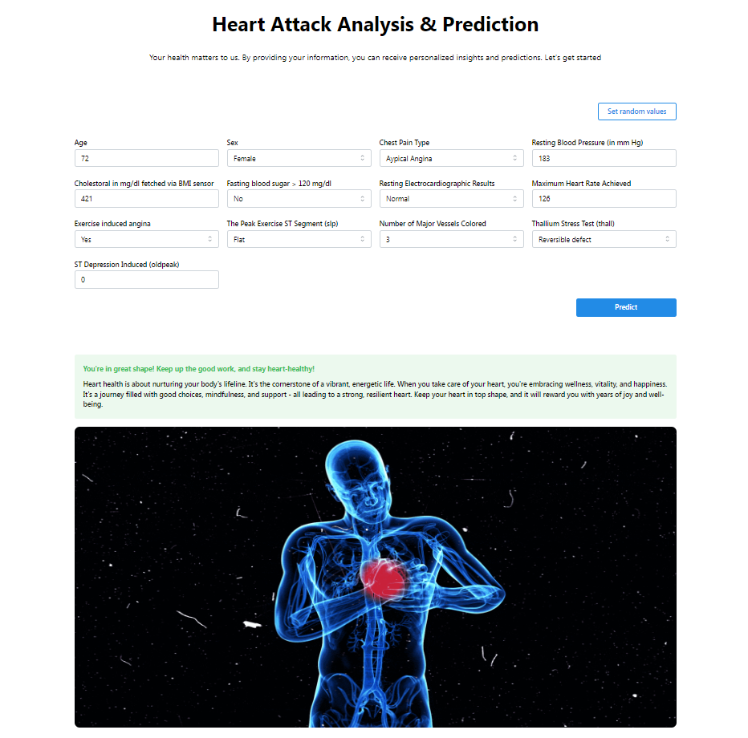

# Heart Attack Analysis & Prediction

A heart attack, also called a myocardial infarction, happens when a part of the heart muscle doesn't get enough blood.
The more time that passes without treatment to restore blood flow, the greater the damage to the heart muscle.
Coronary artery disease (CAD) is the main cause of heart attack.

The dataset can be downloaded at [Kaggle dataset](https://www.kaggle.com/code/tbay97/heart-attack-analysis-prediction)

## Installation

First, clone this repository to your local machine using Git:

```bash
git clone https://github.com/yourusername/your-repo.git
cd your-repo
npm install
```

## Deployment URL

I deployed the client site for demostration, the link is [heart-attack-prediction-client](https://heart-attack-prediction-client.vercel.app/)


